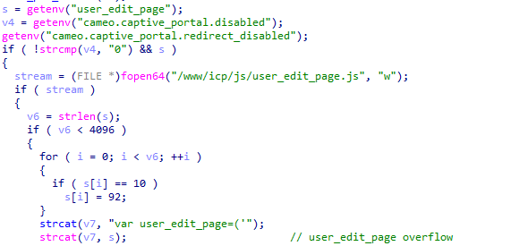

InvRadar（原HidSnap）发现的已知漏洞，共涉及71个隐藏API参数漏洞

# Dlink

### DIR-816 1.10 B05

pingAddr（CI）：[CVE-2018-17068](https://cve.mitre.org/cgi-bin/cvename.cgi?name=CVE-2018-17068)

dest、gateway、custom_interface、netmask（CI、OVER）：[CVE-2021-27113](https://cve.mitre.org/cgi-bin/cvename.cgi?name=CVE-2021-27113)、[CVE-2022-36620](https://cve.mitre.org/cgi-bin/cvename.cgi?name=CVE-2022-36620)

interface（OVER）：[CVE-2022-36620](https://cve.mitre.org/cgi-bin/cvename.cgi?name=CVE-2022-36620)

command（CI）：[CVE-2019-10040](https://cve.mitre.org/cgi-bin/cvename.cgi?name=CVE-2019-10040)

s_ip、s_mac（OVER 2）：[CVE-2021-27114](https://cve.mitre.org/cgi-bin/cvename.cgi?name=CVE-2021-27114)、[CVE-2022-29323](https://cve.mitre.org/cgi-bin/cvename.cgi?name=CVE-2022-29323)

### DIR-830 100

# Cisco

### RV110W 1.2.2.5

ttcp_num 、ttcp_ip、wl_ant、ttcp_size（CI、OVER）:

WL_atten_radio、WL_atten_ctl（CI、OVER）：

sys_iperfWinSize、sys_iperfMode、sys_iperfPort、sys_iperfTime、sys_iperfIP（CI）：

# TrendNet

### TEW-827W 2.06B04

user_edit_page（OVER）：

setlogo_num（OVER）：

update_file_name（OVER 2）：[CVE-2020-14079](https://cve.mitre.org/cgi-bin/cvename.cgi?name=CVE-2020-14079)

folder_path（OVER）：

REMOTE_ADDR（CI，OVER）：[CVE-2020-14078](https://cve.mitre.org/cgi-bin/cvename.cgi?name=CVE-2020-14078)

del_num（OVER）：

ping6_ipaddr（OVER）：

setbg_num（OVER）：

# TOTOLINK

### A3100 V4.1.2cu.5050_B20200504

deviceName、deviceMac （CI、OVER）：[CVE-2022-26212](https://cve.mitre.org/cgi-bin/cvename.cgi?name=CVE-2022-26212)

priority（OVER）：[CVE-2022-29643](https://cve.mitre.org/cgi-bin/cvename.cgi?name=CVE-2022-29643)

endTime、urlKeyword（OVER）：[CVE-2022-29641](https://cve.mitre.org/cgi-bin/cvename.cgi?name=CVE-2022-29641)

magicid（CI）：[CVE-2022-29639](https://cve.mitre.org/cgi-bin/cvename.cgi?name=CVE-2022-29639)

FileName（CI 2、OVER 3）：[CVE-2022-26210](https://cve.mitre.org/cgi-bin/cvename.cgi?name=CVE-2022-26210)、[CVE-2022-26209](https://cve.mitre.org/cgi-bin/cvename.cgi?name=CVE-2022-26209)

http_host（OVER 2）：

# Tenda

### AC6 v15.03.05.19

cmdinput （OVER）：[CVE-2022-25458](https://cve.mitre.org/cgi-bin/cvename.cgi?name=CVE-2022-25458)

mitInterface 、entrys（OVER）：[CVE-2020-13390](https://cve.mitre.org/cgi-bin/cvename.cgi?name=CVE-2020-13390)
