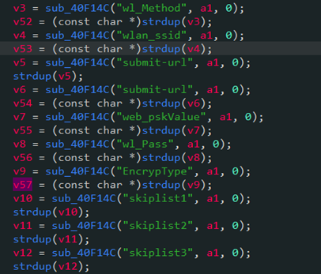
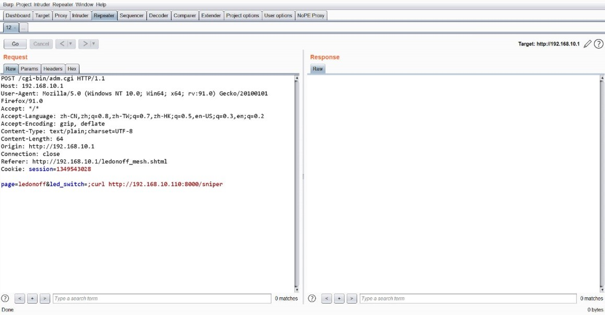
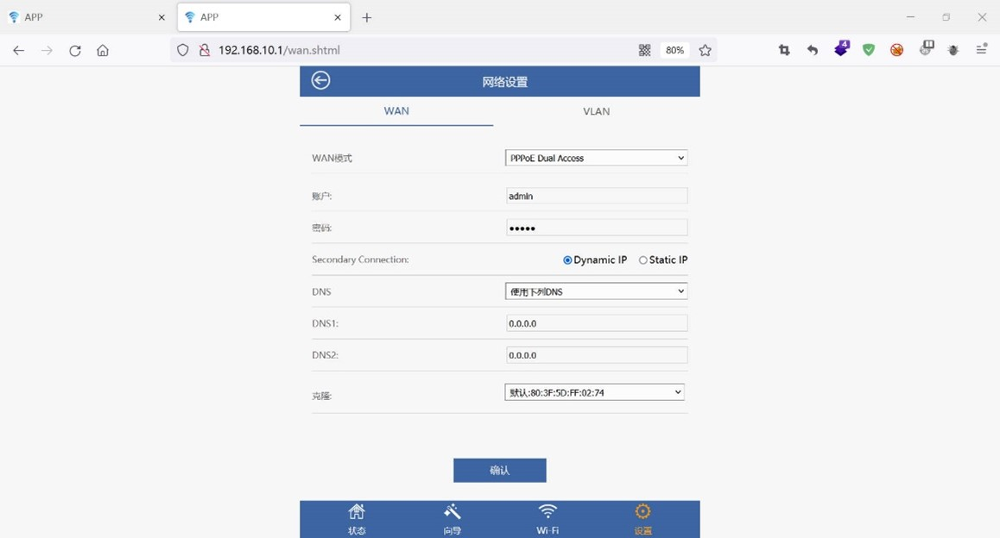
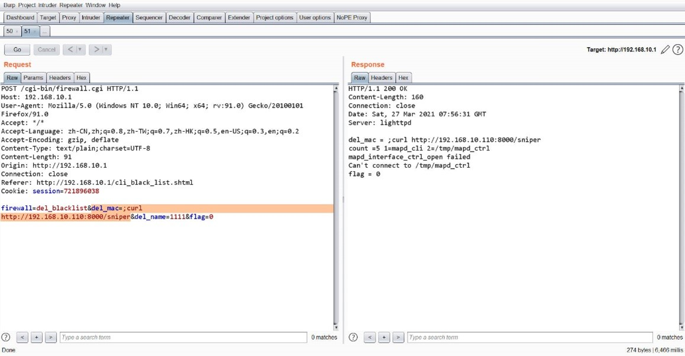
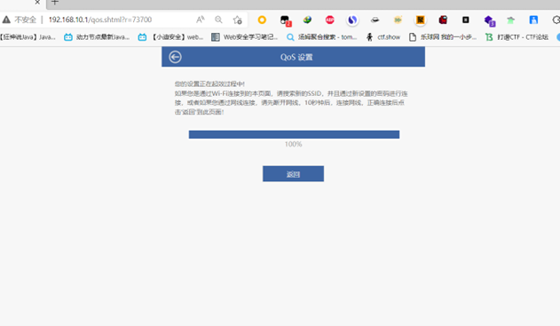
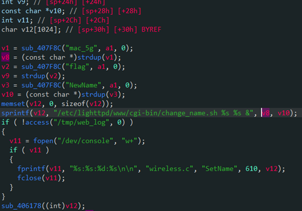

# WAVLINK Router AC1200 page /wizard_router_mesh.shtml Command Injection in adm.cgi
Description: WAVLINK WN572HP3, WN533A8, WN530H4, WN535G3, WN531P3 adm.cgi has no filtering on parameters: web_pskValue, wl_Method, wlan_ssid, EncrypType, rwan_ip, rwan_mask, rwan_gateway, ppp_username, ppp_passwd and ppp_setver, which leads to command injection in page /wizard_router_mesh.shtml.

PoC:
Login is needed.

Visit /wizard_router_mesh.shtml.

When setting ""Router Mode" it redirects to /cgi-bin/adm.cgi with POST parameters: web_pskValue, wl_Method, wlan_ssid, EncrypType, rwan_ip, rwan_mask, rwan_gateway, ppp_username, ppp_passwd and ppp_setver. Use "xxx;command" for command injection.

# WAVLINK Router AC1200 page /ledonoff.shtml Command Injection in adm.cgi
Description: WAVLINK WN572HP3, WN533A8, WN530H4, WN535G3, WN531P3 adm.cgi has no filtering on parameter led_switch, which leads to command injection in page /ledonoff.shtml.

PoC:
Login is needed.

Visit /ledonoff.shtml.

When switching LED, it redirects to /cgi-bin/adm.cgi with POST parameter led_switch. Use "xxx;command" for command injection.

# WAVLINK Router AC1200 page /wan.shtml Command Injection in adm.cgi 
Description: WAVLINK WN572HP3, WN533A8, WN530H4, WN535G3, WN531P3 adm.cgi has no filtering on parameters: ppp_username, ppp_passwd, rwan_gateway, rwan_mask and rwan_ip, which leads to command injection in page /wan.shtml.

PoC:
Login is needed.

Visit /wan.shtml.

When setting "WAN" it redirects to /cgi-bin/adm.cgi with POST parameters: ppp_username, ppp_passwd, rwan_gateway, rwan_mask and rwan_ip. Use "xxx;command" for command injection.

# WAVLINK Router AC1200 page /wizard_rep.shtml Command Injection in adm.cgi 
Description: WAVLINK WN572HP3, WN533A8, WN530H4, WN535G3, WN531P3 adm.cgi has no filtering on parameters: wlan_signal, web_pskValue, sel_EncrypTyp, sel_Automode, wlan_bssid, wlan_ssid and wlan_channel, which leads to command injection in page /wizard_rep.shtml.

PoC:
Login is needed.

Visit /wizard_rep.shtml.

When setting "Repeater Mode" it redirects to /cgi-bin/adm.cgi with POST parameters: wlan_signal, web_pskValue, sel_EncrypTyp, sel_Automode, wlan_bssid, wlan_ssid and wlan_channel. Use "xxx;command" for command injection.

# WAVLINK Router AC1200 page /ledonoff.shtml hidden parameter "ufconf" Command Injection in api.cgi
Description: WAVLINK WN572HP3, WN533A8, WN530H4, WN535G3, WN531P3 api.cgi has no filtering on parameter ufconf, and this is a hidden parameter which doesn't appear in POST body, but exist in cgi binary. This leads to command injection in page /ledonoff.shtml.

PoC:
Login is needed.

Visit /ledonoff.shtml.

When switching LED, it redirects to /cgi-bin/adm.cgi. Change url as /cgi-bin/api.cgi and add "ufconf" in POST body as a parameter. Use "xxx;command" for command injection.

# Command Injection occurs when deleting blacklist in WAVLINK Router AC1200 page /cli_black_list.shtml in firewall.cgi 
Description: WAVLINK WN572HP3, WN533A8, WN530H4, WN535G3, WN531P3 firewall.cgi has no filtering on parameter add_mac, which leads to command injection in page /cli_black_list.shtml.

PoC:
Login is needed.

Visit /cli_black_list.shtml.

When adding WIFI blacklist, it redirects to /cgi-bin/firewall.cgi with POST parameter add_mac. Use "xxx;command" for command injection.

# Command Injection occurs when adding blacklist in WAVLINK Router AC1200 page /cli_black_list.shtml in firewall.cgi
Description: WAVLINK WN572HP3, WN533A8, WN530H4, WN535G3, WN531P3 firewall.cgi has no filtering on parameter del_mac and parameter flag, which leads to command injection in page /cli_black_list.shtml.

PoC:
Login is needed.

Visit /cli_black_list.shtml.

When deleting WIFI blacklist, it redirects to /cgi-bin/firewall.cgi with POST parameters: del_mac and flag. Use "xxx;command" for command injection.

# WAVLINK Router AC1200 page /man_security.shtml Command Injection in firewall.cgi
Description: WAVLINK WN572HP3, WN533A8, WN530H4, WN535G3, WN531P3 firewall.cgi has no filtering on parameters: remoteManagementEnabled, blockPortScanEnabled, pingFrmWANFilterEnabled and blockSynFloodEnabled, which leads to command injection in page /man_security.shtml.

PoC:
Login is needed.

Visit /man_security.shtml.

When setting system firewall, it redirects to /cgi-bin/firewall.cgi with POST parameters: remoteManagementEnabled, blockPortScanEnabled, pingFrmWANFilterEnabled and blockSynFloodEnabled. Use "xxx;command" for command injection.

# WAVLINK Router AC1200 page /login.shtml Command Injection in login.cgi
Description: WAVLINK WN572HP3, WN533A8, WN530H4, WN535G3, WN531P3 login.cgi has no filtering on parameter key, which leads to command injection in page /login.shtml.

PoC:
Visit /login.shtml.

When clicking login, it redirects to /cgi-bin/login.cgi with POST parameter key. Use "xxx;command" for command injection.

# WAVLINK Router AC1200 page /nas_disk.shtml Command Injection in nas.cgi 
Description: WAVLINK WN572HP3, WN533A8, WN530H4, WN535G3, WN531P3 nas.cgi has no filtering on parameters: User1Passwd and User1, which leads to command injection in page /nas_disk.shtml.

PoC:
Login is needed.

Visit /nas_disk.shtml.

When clicking the button, it redirects to /cgi-bin/nas.cgi with POST parameters: User1Passwd and User1. Use "xxx;command" for command injection.

# WAVLINK Router AC1200 page /qos.shtml hidden parameters Command Injection in qos.cgi
Description: WAVLINK WN572HP3, WN533A8, WN530H4, WN535G3, WN531P3 qos.cgi has no filtering on parameters: cli_list and cli_num, which leads to command injection in page /qos.shtml.

PoC:
Login is needed.

Visit /qos.shtml.

When clicking the button, it redirects to /cgi-bin/qos.cgi. Modify POST packet and add parameters: cli_list and cli_num. Use "xxx;command" for command injection.

# WAVLINK Router AC1200 page /qos.shtml Command Injection in qos.cgi
Description: WAVLINK WN572HP3, WN533A8, WN530H4, WN535G3, WN531P3 qos.cgi has no filtering on parameters: qos_bandwith and qos_dat, which leads to command injection in page /qos.shtml.

PoC:
Login is needed.

Visit /qos.shtml.

When clicking the button, it redirects to /cgi-bin/qos.cgi with POST parameters: qos_bandwith and qos_dat. Use "xxx;command" for command injection.

# WAVLINK Router AC1200 page /wifi_multi_ssid.shtml Command Injection in wireless.cgi 
Description: WAVLINK WN572HP3, WN533A8, WN530H4, WN535G3, WN531P3 wireless.cgi has no filtering on parameter hiddenSSID32g and SSID2G2, which leads to command injection in page /wifi_multi_ssid.shtml.

PoC:
Login is needed.

Visit /wifi_multi_ssid.shtml

When setting WIFI SSID to extend, it redirects to /cgi-bin/wireless.cgi with POST parameter hiddenSSID32g and SSID2G2. Use "xxx;command" for command injection.

# WAVLINK Router AC1200 page /wifi_mesh.shtml hidden parameter Command Injection in wireless.cgi 
Description: WAVLINK WN572HP3, WN533A8, WN530H4, WN535G3, WN531P3 wireless.cgi has no filtering on parameters: mac_5g and Newname, which leads to command injection in page /wifi_mesh.shtml.

PoC:
Login is needed.

Visit /wifi_mesh.shtml

When clicking the button, it redirects to /cgi-bin/wireless.cgi. Modify the POST packet and add parameter mac_5g and Newname. Use "xxx;command" for command injection.

# Command Injection occurs when adding extender in WAVLINK Router AC1200 page /wifi_mesh.shtml in wireless.cgi
Description: WAVLINK WN572HP3, WN533A8, WN530H4, WN535G3, WN531P3 wireless.cgi has no filtering on parameter macAddr, which leads to command injection in page /wifi_mesh.shtml.

PoC:
Login is needed.

Visit /wifi_mesh.shtml

When adding the extender, it redirects to /cgi-bin/wireless.cgi with POST parameter macAddr. Use "xxx;command" for command injection.

# Command Injection occurs when clicking the button in WAVLINK Router AC1200 page /wifi_mesh.shtml in wireless.cgi 
Description: WAVLINK WN572HP3, WN533A8, WN530H4, WN535G3, WN531P3 wireless.cgi has no filtering on parameters: delete_list, delete_al_mac, b_delete_list and b_delete_al_mac, which leads to command injection in page /wifi_mesh.shtml.

PoC:
Login is needed.

Visit /wifi_mesh.shtml

When clicking the button, it redirects to /cgi-bin/wireless.cgi with POST parameter mac_5g and Newname. Use "xxx;command" for command injection.
